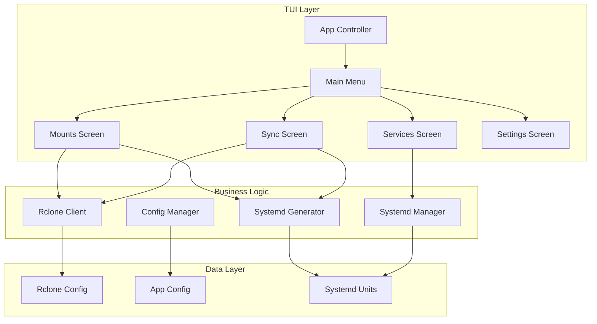
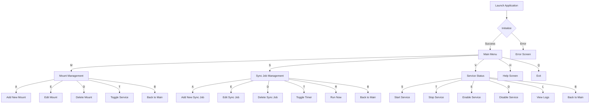
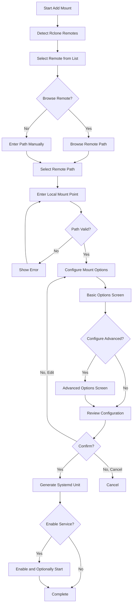
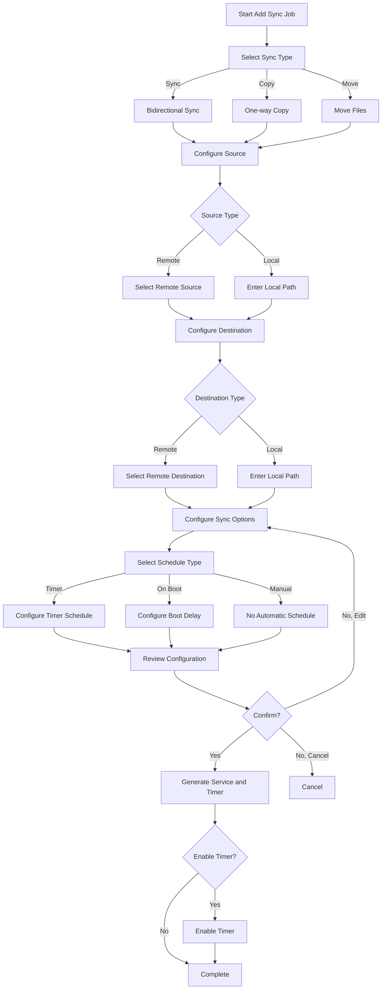
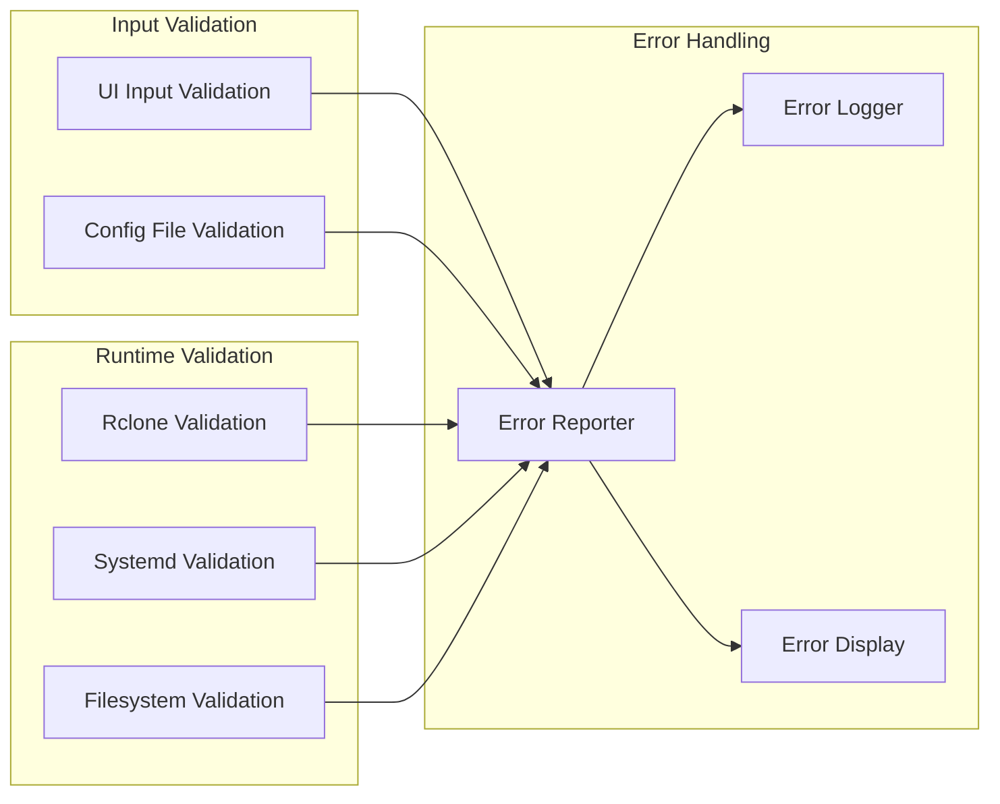

# Rclone Mount Sync TUI - Architecture Design

## Executive Summary

This document outlines the architecture for a Text User Interface (TUI) application that manages rclone mounts and sync jobs, generating systemd user unit files for Linux desktop environments.

---

## 1. Technology Stack Recommendation

### Primary Language: **Go (Golang)**

**Rationale:**
- Single binary distribution - no runtime dependencies
- Excellent TUI library ecosystem (bubbletea, tview)
- Strong standard library for file operations and process management
- Cross-compilation support for different Linux architectures
- Native systemd interaction through D-Bus or command-line tools

### TUI Library: **Bubble Tea (charmbracelet/bubbletea)**

**Rationale:**
- Modern, Elm-inspired architecture with clean separation of concerns
- Composable components (bubbles) for lists, forms, inputs, tables
- Excellent keyboard navigation and accessibility
- Active maintenance and community support
- Built-in support for common patterns (forms, navigation, help)

**Supporting Libraries:**
| Library | Purpose |
|---------|---------|
| `bubbletea` | Core TUI framework |
| `bubbles` | Pre-built UI components (text input, list, table, spinner) |
| `lipgloss` | Styling and layout |
| `huh` | Form library for complex input flows |
| `viper` | Configuration management |
| `cobra` | CLI argument parsing |

---

## 2. Application Structure and Components

### Directory Structure

```
rclone-mount-sync/
├── cmd/
│   └── rclone-mount-sync/
│       └── main.go              # Application entry point
├── internal/
│   ├── tui/
│   │   ├── app.go               # Main TUI application
│   │   ├── screens/
│   │   │   ├── main_menu.go     # Main navigation screen
│   │   │   ├── mounts.go        # Mount management screen
│   │   │   ├── sync_jobs.go     # Sync job management screen
│   │   │   ├── services.go      # Service status/management screen
│   │   │   └── settings.go      # Application settings
│   │   ├── components/
│   │   │   ├── form.go          # Reusable form component
│   │   │   ├── list.go          # Enhanced list component
│   │   │   ├── dialog.go        # Modal dialogs
│   │   │   └── status_bar.go    # Status bar component
│   │   └── styles/
│   │       └── theme.go         # Color scheme and styles
│   ├── rclone/
│   │   ├── client.go            # Rclone command wrapper
│   │   ├── config.go            # Rclone config parsing
│   │   ├── remotes.go           # Remote discovery
│   │   └── validation.go        # Rclone validation
│   ├── systemd/
│   │   ├── generator.go         # Unit file generation
│   │   ├── manager.go           # Service management
│   │   ├── templates.go         # Unit file templates
│   │   └── paths.go             # Systemd path resolution
│   ├── models/
│   │   ├── mount.go             # Mount configuration model
│   │   ├── sync_job.go          # Sync job configuration model
│   │   └── service.go           # Service status model
│   ├── config/
│   │   ├── app_config.go        # Application configuration
│   │   └── storage.go           # Config file persistence
│   └── utils/
│       ├── fs.go                # Filesystem utilities
│       └── validation.go        # General validation helpers
├── pkg/
│   └── api/                     # Public API (if needed for extensions)
├── configs/
│   └── default.yaml             # Default configuration
├── Makefile                     # Build automation
├── go.mod
└── go.sum
```

### Component Architecture



---

## 3. Data Models

### Mount Configuration

```go
// internal/models/mount.go

type MountConfig struct {
    // Identification
    ID          string `json:"id" yaml:"id"`
    Name        string `json:"name" yaml:"name"`
    Description string `json:"description,omitempty" yaml:"description,omitempty"`
    
    // Rclone Configuration
    Remote      string `json:"remote" yaml:"remote"`           // e.g., "gdrive:"
    RemotePath  string `json:"remote_path" yaml:"remote_path"` // e.g., "/" or "/Music"
    MountPoint  string `json:"mount_point" yaml:"mount_point"` // Local mount path
    
    // Mount Options
    MountOptions MountOptions `json:"mount_options" yaml:"mount_options"`
    
    // Service Configuration
    AutoStart   bool `json:"auto_start" yaml:"auto_start"`
    Enabled     bool `json:"enabled" yaml:"enabled"`
    
    // Metadata
    CreatedAt   time.Time `json:"created_at" yaml:"created_at"`
    ModifiedAt  time.Time `json:"modified_at" yaml:"modified_at"`
}

type MountOptions struct {
    // FUSE Options
    AllowOther       bool   `json:"allow_other,omitempty" yaml:"allow_other,omitempty"`
    AllowRoot        bool   `json:"allow_root,omitempty" yaml:"allow_root,omitempty"`
    Umask            string `json:"umask,omitempty" yaml:"umask,omitempty"`         // e.g., "002"
    UID              int    `json:"uid,omitempty" yaml:"uid,omitempty"`
    GID              int    `json:"gid,omitempty" yaml:"gid,omitempty"`
    
    // Performance Options
    BufferSize       string `json:"buffer_size,omitempty" yaml:"buffer_size,omitempty"`     // e.g., "16M"
    DirCacheTime     string `json:"dir_cache_time,omitempty" yaml:"dir_cache_time,omitempty"`
    VFSReadChunkSize string `json:"vfs_read_chunk_size,omitempty" yaml:"vfs_read_chunk_size,omitempty"`
    VFSCacheMode     string `json:"vfs_cache_mode,omitempty" yaml:"vfs_cache_mode,omitempty"` // off, full, writes
    
    // Behavior Options
    NoModTime        bool   `json:"no_modtime,omitempty" yaml:"no_modtime,omitempty"`
    NoChecksum       bool   `json:"no_checksum,omitempty" yaml:"no_checksum,omitempty"`
    ReadOnly         bool   `json:"read_only,omitempty" yaml:"read_only,omitempty"`
    
    // Network Options
    ConnectTimeout   string `json:"connect_timeout,omitempty" yaml:"connect_timeout,omitempty"`
    Timeout          string `json:"timeout,omitempty" yaml:"timeout,omitempty"`
    
    // Advanced
    Config           string `json:"config,omitempty" yaml:"config,omitempty"`     // Custom rclone config file
    ExtraArgs        string `json:"extra_args,omitempty" yaml:"extra_args,omitempty"` // Additional CLI args
}
```

### Sync Job Configuration

```go
// internal/models/sync_job.go

type SyncJobConfig struct {
    // Identification
    ID          string `json:"id" yaml:"id"`
    Name        string `json:"name" yaml:"name"`
    Description string `json:"description,omitempty" yaml:"description,omitempty"`
    
    // Rclone Configuration
    Source      string `json:"source" yaml:"source"`           // e.g., "gdrive:/Photos"
    Destination string `json:"destination" yaml:"destination"` // e.g., "/home/user/Backup/Photos"
    
    // Sync Options
    SyncOptions SyncOptions `json:"sync_options" yaml:"sync_options"`
    
    // Schedule Configuration
    Schedule    ScheduleConfig `json:"schedule" yaml:"schedule"`
    
    // Service Configuration
    AutoStart   bool `json:"auto_start" yaml:"auto_start"` // Start timer on boot
    Enabled     bool `json:"enabled" yaml:"enabled"`
    
    // Metadata
    CreatedAt   time.Time `json:"created_at" yaml:"created_at"`
    ModifiedAt  time.Time `json:"modified_at" yaml:"modified_at"`
    LastRun     time.Time `json:"last_run,omitempty" yaml:"last_run,omitempty"`
}

type SyncOptions struct {
    // Sync Direction & Behavior
    Direction    string `json:"direction" yaml:"direction"` // "sync", "copy", "move"
    
    // Conflict Resolution
    ConflictResolution string `json:"conflict_resolution,omitempty" yaml:"conflict_resolution,omitempty"`
    // Options: "newer", "larger", "none"
    
    // Deletion Handling
    DeleteExtraneous bool `json:"delete_extraneous,omitempty" yaml:"delete_extraneous,omitempty"`
    DeleteAfter      bool `json:"delete_after,omitempty" yaml:"delete_after,omitempty"`
    
    // Filtering
    IncludePattern string `json:"include_pattern,omitempty" yaml:"include_pattern,omitempty"`
    ExcludePattern string `json:"exclude_pattern,omitempty" yaml:"exclude_pattern,omitempty"`
    MaxAge         string `json:"max_age,omitempty" yaml:"max_age,omitempty"` // e.g., "30d"
    MinAge         string `json:"min_age,omitempty" yaml:"min_age,omitempty"`
    
    // Performance
    Transfers      int    `json:"transfers,omitempty" yaml:"transfers,omitempty"` // Parallel transfers
    Checkers       int    `json:"checkers,omitempty" yaml:"checkers,omitempty"`
    BandwidthLimit string `json:"bandwidth_limit,omitempty" yaml:"bandwidth_limit,omitempty"` // e.g., "10M"
    
    // Verification
    CheckSum       bool `json:"checksum,omitempty" yaml:"checksum,omitempty"`
    DryRun         bool `json:"dry_run,omitempty" yaml:"dry_run,omitempty"`
    
    // Advanced
    Config         string `json:"config,omitempty" yaml:"config,omitempty"`
    ExtraArgs      string `json:"extra_args,omitempty" yaml:"extra_args,omitempty"`
}

type ScheduleConfig struct {
    // Schedule Type
    Type string `json:"type" yaml:"type"` // "timer", "onboot", "manual"
    
    // Timer Configuration (systemd timer syntax)
    OnCalendar    string `json:"on_calendar,omitempty" yaml:"on_calendar,omitempty"` // e.g., "daily", "*-*-* 02:00:00"
    OnBootSec     string `json:"on_boot_sec,omitempty" yaml:"on_boot_sec,omitempty"` // e.g., "5min"
    OnActiveSec   string `json:"on_active_sec,omitempty" yaml:"on_active_sec,omitempty"`
    
    // Retry Configuration
    RandomizedDelaySec string `json:"randomized_delay_sec,omitempty" yaml:"randomized_delay_sec,omitempty"`
    Persistent         bool   `json:"persistent,omitempty" yaml:"persistent,omitempty"` // Catch up missed runs
}
```

### Service Status Model

```go
// internal/models/service.go

type ServiceStatus struct {
    Name        string    `json:"name"`
    Type        string    `json:"type"` // "mount" or "sync"
    UnitFile    string    `json:"unit_file"`
    
    // Systemd Status
    LoadState   string    `json:"load_state"`   // "loaded", "not-found", etc.
    ActiveState string    `json:"active_state"` // "active", "inactive", "failed"
    SubState    string    `json:"sub_state"`    // "running", "exited", "dead", etc.
    
    // Service Details
    Enabled     bool      `json:"enabled"`
    MainPID     int       `json:"main_pid,omitempty"`
    ExitCode    int       `json:"exit_code,omitempty"`
    
    // Timestamps
    ActivatedAt time.Time `json:"activated_at,omitempty"`
    InactiveAt  time.Time `json:"inactive_at,omitempty"`
    
    // For mounts
    MountPoint  string    `json:"mount_point,omitempty"`
    IsMounted   bool      `json:"is_mounted,omitempty"`
    
    // For sync jobs
    LastRun     time.Time `json:"last_run,omitempty"`
    NextRun     time.Time `json:"next_run,omitempty"`
    TimerActive bool      `json:"timer_active,omitempty"`
}
```

---

## 4. Systemd Unit File Templates

### Mount Service Template

```ini
# ~/.config/systemd/user/rclone-mount-{name}.service

[Unit]
Description=Rclone mount: {description}
Documentation=man:rclone(1)
After=network-online.target
Wants=network-online.target
StartLimitIntervalSec=30
StartLimitBurst=5

[Service]
Type=notify
# Ensure mount directory exists
ExecStartPre=/bin/mkdir -p {mount_point}

# Main mount command
ExecStart=/usr/bin/rclone mount \
    {remote}{remote_path} \
    {mount_point} \
    --config={config_path} \
    {mount_options} \
    --log-level={log_level} \
    --log-file={log_path} \
    --syslog \
    --vfs-log-level={vfs_log_level}

# Unmount on stop
ExecStop=/bin/fusermount -u {mount_point}
ExecStopPost=/bin/rmdir {mount_point}

# Restart configuration
Restart=on-failure
RestartSec=5s

# Environment
Environment="PATH=/usr/local/bin:/usr/bin:/bin"

# Security hardening (user scope)
NoNewPrivileges=true

[Install]
WantedBy=default.target
```

### Sync Service Template

```ini
# ~/.config/systemd/user/rclone-sync-{name}.service

[Unit]
Description=Rclone sync: {description}
Documentation=man:rclone(1)
After=network-online.target
Wants=network-online.target

[Service]
Type=oneshot

# Main sync command
ExecStart=/usr/bin/rclone {direction} \
    {source} \
    {destination} \
    --config={config_path} \
    {sync_options} \
    --log-level={log_level} \
    --log-file={log_path}

# Environment
Environment="PATH=/usr/local/bin:/usr/bin:/bin"

# Resource limits
MemoryMax=1G
CPUQuota=50%

[Install]
WantedBy=default.target
```

### Sync Timer Template

```ini
# ~/.config/systemd/user/rclone-sync-{name}.timer

[Unit]
Description=Timer for rclone sync: {description}
Documentation=man:rclone(1)

[Timer]
{timer_directives}
# Examples:
# OnCalendar=daily
# OnCalendar=*-*-* 02:00:00
# OnBootSec=5min
# OnUnitActiveSec=1h
# RandomizedDelaySec=300
# Persistent=true

[Install]
WantedBy=timers.target
```

---

## 5. User Flow Design

### Main Navigation Flow



### Add Mount Flow



### Add Sync Job Flow



### Screen Layout Design

```
┌─────────────────────────────────────────────────────────────────────┐
│ Rclone Mount Sync v1.0.0                              [?] Help, [Q] Quit│
├─────────────────────────────────────────────────────────────────────┤
│                                                                     │
│   ┌─────────────────────────────────────────────────────────────┐   │
│   │                        MAIN MENU                             │   │
│   │                                                              │   │
│   │   [M] Mount Management                                       │   │
│   │       Configure and manage rclone mount points               │   │
│   │                                                              │   │
│   │   [S] Sync Job Management                                    │   │
│   │       Configure and schedule rclone sync operations          │   │
│   │                                                              │   │
│   │   [V] Service Status                                         │   │
│   │       View and control systemd services                      │   │
│   │                                                              │   │
│   │   [H] Help & Documentation                                   │   │
│   │       View usage instructions and configuration help         │   │
│   │                                                              │   │
│   └─────────────────────────────────────────────────────────────┘   │
│                                                                     │
├─────────────────────────────────────────────────────────────────────┤
│ Status: 3 mounts configured, 2 sync jobs active                     │
└─────────────────────────────────────────────────────────────────────┘
```

### Mount List Screen

```
┌─────────────────────────────────────────────────────────────────────┐
│ Mount Management                                    [A] Add, [Q] Back│
├─────────────────────────────────────────────────────────────────────┤
│                                                                     │
│   Name              Remote              Mount Point        Status   │
│   ────────────────────────────────────────────────────────────────  │
│   ▸ Google Drive    gdrive:             ~/mnt/gdrive      ● Active │
│     Dropbox         dropbox:            ~/mnt/dropbox     ○ Stopped│
│     S3 Backup       s3:backup-bucket    ~/mnt/s3backup    ● Active │
│                                                                     │
│                                                                     │
│   ┌─────────────────────────────────────────────────────────────┐   │
│   │ Selected: Google Drive                                      │   │
│   │ Remote: gdrive:/                                            │   │
│   │ Mount Point: /home/user/mnt/gdrive                          │   │
│   │ Status: Active (running since 2024-01-15 10:30)             │   │
│   │                                                              │   │
│   │ [E] Edit  [D] Delete  [T] Toggle  [L] Logs  [R] Refresh     │   │
│   └─────────────────────────────────────────────────────────────┘   │
│                                                                     │
├─────────────────────────────────────────────────────────────────────┤
│ ↑/↓ Navigate, Enter=Select, [A] Add new mount                       │
└─────────────────────────────────────────────────────────────────────┘
```

### Add Mount Form Screen

```
┌─────────────────────────────────────────────────────────────────────┐
│ Add New Mount - Step 1 of 3                          [Esc] Cancel   │
├─────────────────────────────────────────────────────────────────────┤
│                                                                     │
│   ┌─────────────────────────────────────────────────────────────┐   │
│   │ Basic Configuration                                         │   │
│   │                                                             │   │
│   │ Mount Name: [Google Drive_______________________________]   │   │
│   │                                                             │   │
│   │ Remote:     [gdrive:_______________________________] [Tab]  │   │
│   │             ┌───────────────────────────────────────────┐   │   │
│   │             │ ▸ gdrive:                                 │   │   │
│   │             │   dropbox:                                │   │   │
│   │             │   s3:                                     │   │   │
│   │             │   onedrive:                               │   │   │
│   │             └───────────────────────────────────────────┘   │   │
│   │                                                             │   │
│   │ Remote Path: [/_________________________________________]   │   │
│   │                                                             │   │
│   │ Mount Point: [~/mnt/gdrive_____________________________]   │   │
│   │                                                             │   │
│   │ [Tab] Next Field    [Enter] Continue    [Esc] Cancel        │   │
│   └─────────────────────────────────────────────────────────────┘   │
│                                                                     │
├─────────────────────────────────────────────────────────────────────┤
│ Step 1: Basic Configuration → Step 2: Mount Options → Step 3: Review│
└─────────────────────────────────────────────────────────────────────┘
```

---

## 6. Error Handling and Validation Approach

### Validation Layers



### Validation Rules

#### Mount Configuration Validation

| Field | Validation Rules |
|-------|-----------------|
| Name | Required, alphanumeric with dashes/underscores, unique |
| Remote | Required, must exist in rclone config |
| RemotePath | Must be valid path format |
| MountPoint | Required, must be absolute or ~-prefixed path, parent must exist |
| MountPoint | Must not already be a mount point (unless updating) |

#### Sync Job Configuration Validation

| Field | Validation Rules |
|-------|-----------------|
| Name | Required, alphanumeric with dashes/underscores, unique |
| Source | Required, valid rclone remote:path or local path |
| Destination | Required, valid rclone remote:path or local path |
| Schedule | Valid systemd timer syntax if timer type |

### Error Types and Handling

```go
// internal/utils/errors.go

type ErrorType int

const (
    ErrorTypeValidation ErrorType = iota
    ErrorTypeRclone
    ErrorTypeSystemd
    ErrorTypeFilesystem
    ErrorTypeNetwork
    ErrorTypeConfiguration
)

type AppError struct {
    Type        ErrorType
    Code        string
    Message     string
    Details     string
    Suggestion  string
    Cause       error
}

// Example errors
var (
    ErrRcloneNotFound = &AppError{
        Type:       ErrorTypeRclone,
        Code:       "RCLONE_001",
        Message:    "rclone is not installed",
        Suggestion: "Install rclone using your package manager or from https://rclone.org/install/",
    }
    
    ErrNoRemotesConfigured = &AppError{
        Type:       ErrorTypeRclone,
        Code:       "RCLONE_002",
        Message:    "No rclone remotes are configured",
        Suggestion: "Run 'rclone config' to set up a remote first",
    }
    
    ErrMountPointExists = &AppError{
        Type:       ErrorTypeValidation,
        Code:       "VAL_001",
        Message:    "Mount point is already in use",
        Suggestion: "Choose a different mount point or unmount the existing mount first",
    }
    
    ErrInvalidTimerSyntax = &AppError{
        Type:       ErrorTypeValidation,
        Code:       "VAL_002",
        Message:    "Invalid timer schedule syntax",
        Suggestion: "Use formats like 'daily', 'hourly', or '*-*-* 02:00:00'",
    }
)
```

### Pre-flight Checks

```go
// internal/rclone/validation.go

func PreflightChecks() []AppError {
    var errors []AppError
    
    // 1. Check rclone is installed
    if _, err := exec.LookPath("rclone"); err != nil {
        errors = append(errors, ErrRcloneNotFound)
        return errors // Can't continue without rclone
    }
    
    // 2. Check rclone version (minimum version)
    if err := checkRcloneVersion("1.60.0"); err != nil {
        errors = append(errors, &AppError{
            Type:    ErrorTypeRclone,
            Code:    "RCLONE_003",
            Message: "rclone version too old",
            Cause:   err,
        })
    }
    
    // 3. Check for configured remotes
    remotes, err := listRemotes()
    if err != nil {
        errors = append(errors, &AppError{
            Type:    ErrorTypeRclone,
            Code:    "RCLONE_004",
            Message: "Failed to read rclone configuration",
            Cause:   err,
        })
    } else if len(remotes) == 0 {
        errors = append(errors, ErrNoRemotesConfigured)
    }
    
    // 4. Check systemd is available (user session)
    if err := checkSystemdUserSession(); err != nil {
        errors = append(errors, &AppError{
            Type:    ErrorTypeSystemd,
            Code:    "SYS_001",
            Message: "systemd user session not available",
            Cause:   err,
        })
    }
    
    // 5. Check fusermount is available (for mounts)
    if _, err := exec.LookPath("fusermount"); err != nil {
        errors = append(errors, &AppError{
            Type:    ErrorTypeFilesystem,
            Code:    "FS_001",
            Message: "fusermount not found",
            Suggestion: "Install fuse3 or fuse package",
        })
    }
    
    return errors
}
```

### Error Display in TUI

```
┌─────────────────────────────────────────────────────────────────────┐
│ ⚠ Error                                                            │
├─────────────────────────────────────────────────────────────────────┤
│                                                                     │
│   ┌─────────────────────────────────────────────────────────────┐   │
│   │                                                             │   │
│   │   ⚠ rclone is not installed                                │   │
│   │                                                             │   │
│   │   Install rclone using your package manager or from        │   │
│   │   https://rclone.org/install/                              │   │
│   │                                                             │   │
│   │   Error Code: RCLONE_001                                   │   │
│   │                                                             │   │
│   │                              [R] Retry  [Q] Quit Application │   │
│   └─────────────────────────────────────────────────────────────┘   │
│                                                                     │
└─────────────────────────────────────────────────────────────────────┘
```

---

## 7. Configuration Storage

### Application Configuration File

Location: `~/.config/rclone-mount-sync/config.yaml`

```yaml
# Application Configuration
version: "1.0"
 
# Default settings
defaults:
  mount:
    log_level: "INFO"
    vfs_cache_mode: "full"
    buffer_size: "16M"
    
  sync:
    log_level: "INFO"
    transfers: 4
    checkers: 8
    
# Configured mounts
mounts:
  - id: "google-drive"
    name: "Google Drive"
    remote: "gdrive:"
    remote_path: "/"
    mount_point: "~/mnt/gdrive"
    mount_options:
      vfs_cache_mode: "full"
      buffer_size: "16M"
    auto_start: true
    enabled: true
    
# Configured sync jobs
sync_jobs:
  - id: "photos-backup"
    name: "Photos Backup"
    source: "gdrive:/Photos"
    destination: "~/Backup/Photos"
    sync_options:
      direction: "sync"
      delete_extraneous: true
    schedule:
      type: "timer"
      on_calendar: "daily"
      persistent: true
    auto_start: true
    enabled: true
```

---

## 8. Implementation Phases

### Phase 1: Core Infrastructure
- [ ] Project setup and dependency management
- [ ] Configuration file handling (read/write YAML)
- [ ] Rclone command wrapper and remote detection
- [ ] Systemd unit file generation

### Phase 2: TUI Framework
- [ ] Main application structure with Bubble Tea
- [ ] Screen navigation system
- [ ] Base components (forms, lists, dialogs)
- [ ] Styling and theme system

### Phase 3: Mount Management
- [ ] Mount list screen
- [ ] Add mount wizard
- [ ] Edit mount functionality
- [ ] Delete mount with cleanup
- [ ] Service toggle (enable/disable/start/stop)

### Phase 4: Sync Job Management
- [ ] Sync job list screen
- [ ] Add sync job wizard
- [ ] Edit sync job functionality
- [ ] Delete sync job with cleanup
- [ ] Timer management
- [ ] Manual run trigger

### Phase 5: Service Management
- [ ] Service status screen
- [ ] Real-time status updates
- [ ] Log viewing integration
- [ ] Bulk operations

### Phase 6: Polish and Testing
- [ ] Error handling refinement
- [ ] Input validation
- [ ] Help system
- [ ] Documentation
- [ ] Integration testing

---

## 9. Key Implementation Details

### Rclone Remote Detection

```go
// internal/rclone/remotes.go

func (c *Client) ListRemotes() ([]Remote, error) {
    // Parse rclone config file directly
    configPath := c.getRcloneConfigPath()
    
    cfg, err := ini.Load(configPath)
    if err != nil {
        return nil, fmt.Errorf("failed to load rclone config: %w", err)
    }
    
    var remotes []Remote
    for _, section := range cfg.Sections() {
        name := section.Name()
        if name == "DEFAULT" || strings.HasPrefix(name, "RCLONE_CONFIG_") {
            continue
        }
        
        // Check if it's a remote section (has 'type' key)
        if section.HasKey("type") {
            remote := Remote{
                Name:     name,
                Type:     section.Key("type").String(),
                RootPath: name + ":",
            }
            remotes = append(remotes, remote)
        }
    }
    
    return remotes, nil
}
```

### Systemd Manager Integration

```go
// internal/systemd/manager.go

type Manager struct {
    systemctlPath string
    userFlag      bool
}

func NewManager() (*Manager, error) {
    systemctlPath, err := exec.LookPath("systemctl")
    if err != nil {
        return nil, fmt.Errorf("systemctl not found: %w", err)
    }
    
    return &Manager{
        systemctlPath: systemctlPath,
        userFlag:      true, // Always use --user flag
    }, nil
}

func (m *Manager) EnableUnit(name string) error {
    cmd := exec.Command(m.systemctlPath, "--user", "enable", name)
    return cmd.Run()
}

func (m *Manager) StartUnit(name string) error {
    cmd := exec.Command(m.systemctlPath, "--user", "start", name)
    return cmd.Run()
}

func (m *Manager) GetUnitStatus(name string) (*ServiceStatus, error) {
    cmd := exec.Command(m.systemctlPath, "--user", "show", name,
        "--property=LoadState,ActiveState,SubState,MainPID")
    output, err := cmd.Output()
    if err != nil {
        return nil, err
    }
    
    return parseStatusOutput(output), nil
}
```

---

## 10. Security Considerations

1. **Credential Safety**: Never log or display rclone credentials
2. **File Permissions**: Generated unit files should have 0600 permissions
3. **Path Validation**: Prevent directory traversal attacks in paths
4. **Command Injection**: Sanitize all user inputs before shell execution
5. **Service Isolation**: Use systemd security hardening options where applicable

---

## Summary

This architecture provides a robust foundation for a TUI application that:

1. **Uses Go with Bubble Tea** for a responsive, maintainable TUI
2. **Separates concerns** with clear layers (TUI, business logic, data)
3. **Supports full lifecycle management** of mounts and sync jobs
4. **Generates proper systemd user units** with appropriate options
5. **Provides comprehensive validation** and user-friendly error messages
6. **Stores configuration** in standard XDG paths

The modular design allows for future extensions such as:
- Multiple rclone config file support
- Import/export of configurations
- Remote browsing capabilities
- Advanced scheduling options
- Multi-language support
