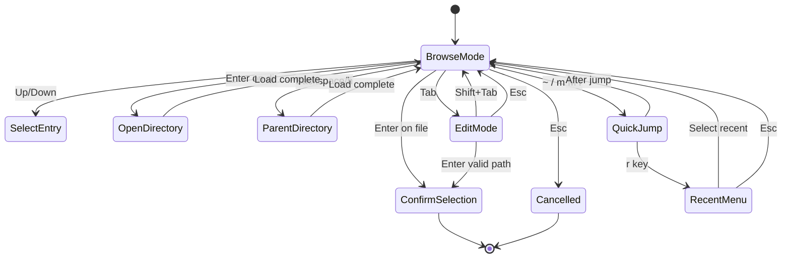

# Folder Navigation UX Improvements Design Document

## Executive Summary

This document outlines the design for improving the folder navigation experience in the rclone-mount-sync TUI application. The current implementation uses `huh.NewFilePicker()` with minimal customization, resulting in a basic file browsing experience that lacks visual distinction between files and folders, navigation shortcuts, and path visibility.

## Current State Analysis

### Existing Implementation

The file picker is used in three locations:

1. **Mount Form** ([`mount_form.go:177-184`](internal/tui/screens/mount_form.go:177))
   ```go
   huh.NewFilePicker().
       Title("Mount Point").
       Description("Local directory where the remote will be mounted...").
       DirAllowed(true).
       FileAllowed(false).
       CurrentDirectory(components.ExpandHome("~/mnt")).
       Value(&f.mountPoint).
       Validate(f.validateMountPoint)
   ```

2. **Sync Job Form** ([`sync_job_form.go:241-248`](internal/tui/screens/sync_job_form.go:241))
   ```go
   huh.NewFilePicker().
       Title("Destination Path").
       Description("Local directory for synced files...").
       DirAllowed(true).
       FileAllowed(false).
       CurrentDirectory(homeDir).
       Value(&f.destPath).
       Validate(f.validateDestPath)
   ```

3. **Settings Screen** ([`settings.go:441-447`](internal/tui/screens/settings.go:441))
   - Export configuration file picker
   - Import configuration file picker

### Existing Helper Functions

The [`path_helpers.go`](internal/tui/components/path_helpers.go) file provides:
- `GetCommonDirectories()` - Returns common directories like `~/`, `~/mnt/`, `/mnt/`, `/media/`
- `GetPathSuggestions()` - Combines recent paths with common directories
- `ExpandHome()` / `ContractHome()` - Home directory path expansion/contraction

### Limitations of Current Approach

1. **No Visual Distinction**: The huh file picker displays all entries uniformly
2. **No Path Context**: Users cannot see where they are in the filesystem hierarchy
3. **No Quick Navigation**: Must navigate directory-by-directory
4. **Limited Customization**: The huh library's FilePicker has limited extensibility

---

## Proposed Solution

### Approach: Custom File Picker Component

Since the `huh.FilePicker` has limited customization options, we will create a custom file picker component that wraps and extends the functionality. This approach allows:

- Full control over rendering and key handling
- Addition of custom features while maintaining compatibility
- Gradual migration from the existing implementation

### Component Architecture

```
┌─────────────────────────────────────────────────────────────────┐
│                     EnhancedFilePicker                          │
├─────────────────────────────────────────────────────────────────┤
│  ┌───────────────────────────────────────────────────────────┐  │
│  │ Breadcrumb: Home > mnt > projects                         │  │
│  └───────────────────────────────────────────────────────────┘  │
│  ┌───────────────────────────────────────────────────────────┐  │
│  │ Quick Jump Bar: [~] [/] [mnt] [media] [recent]            │  │
│  └───────────────────────────────────────────────────────────┘  │
│  ┌───────────────────────────────────────────────────────────┐  │
│  │ 📁 ..                                          [Parent]  │  │
│  │ 📁 Documents                                             │  │
│  │ 📁 Downloads                                             │  │
│  │ 📁 Pictures                                              │  │
│  │ 📄 notes.txt                                             │  │
│  │ 📄 readme.md                                             │  │
│  └───────────────────────────────────────────────────────────┘  │
│  ┌───────────────────────────────────────────────────────────┐  │
│  │ Selected: /home/user/Documents                           │  │
│  │ [Enter] Select  [Esc] Cancel  [Backspace] Parent  [?] Help│  │
│  └───────────────────────────────────────────────────────────┘  │
└─────────────────────────────────────────────────────────────────┘
```

---

## Visual Mockups

### Mockup 1: Basic File Picker View

```
┌─────────────────────────────────────────────────────────────────┐
│                      Select Mount Point                         │
├─────────────────────────────────────────────────────────────────┤
│                                                                 │
│  🏠 /home/user                                                  │
│  ─────────────────────────────────────────────────────────────  │
│                                                                 │
│  Quick Jump: [~] [/] [m]mnt [M]edia                             │
│                                                                 │
│  ┌─────────────────────────────────────────────────────────┐   │
│  │ 📁 ──                    < Parent Directory             │   │
│  │ 📁 Desktop                                          ▸   │   │
│  │ 📁 Documents                                        ▸   │   │
│  │ 📁 Downloads                                        ▸   │   │
│  │ 📁 mnt                                              ▸   │   │
│  │ 📁 Pictures                                         ▸   │   │
│  │ 📁 Videos                                           ▸   │   │
│  └─────────────────────────────────────────────────────────┘   │
│                                                                 │
│  Selected: /home/user/                                          │
│                                                                 │
│  [Enter] Open/Select  [Esc] Cancel  [Backspace] Parent          │
└─────────────────────────────────────────────────────────────────┘
```

### Mockup 2: With Recent Locations Dropdown

```
┌─────────────────────────────────────────────────────────────────┐
│                      Select Mount Point                         │
├─────────────────────────────────────────────────────────────────┤
│                                                                 │
│  🏠 /home/user/mnt                                              │
│  ─────────────────────────────────────────────────────────────  │
│                                                                 │
│  Quick Jump: [~] [/] [m]mnt [M]edia [r]Recent ▼                 │
│                                          ┌──────────────────┐   │
│  ┌────────────────────────────────────┐  │ ~/mnt/gdrive     │   │
│  │ 📁 ──                    < Parent │  │ ~/mnt/onedrive   │   │
│  │ 📁 gdrive                           │  │ ~/mounts/photos  │   │
│  │ 📁 onedrive                         │  │ /media/backup    │   │
│  │ 📁 photos                           │  └──────────────────┘   │
│  └────────────────────────────────────────────────────────────┘   │
│                                                                 │
│  Selected: /home/user/mnt/                                      │
│                                                                 │
│  [Enter] Open/Select  [Esc] Cancel  [Backspace] Parent          │
└─────────────────────────────────────────────────────────────────┘
```

### Mockup 3: Directory Selected

```
┌─────────────────────────────────────────────────────────────────┐
│                      Select Mount Point                         │
├─────────────────────────────────────────────────────────────────┤
│                                                                 │
│  🏠 /home/user/mnt/gdrive                                       │
│  ─────────────────────────────────────────────────────────────  │
│                                                                 │
│  Quick Jump: [~] [/] [m]mnt [M]edia                             │
│                                                                 │
│  ┌─────────────────────────────────────────────────────────┐   │
│  │ 📁 ──                    < Parent Directory             │   │
│  │ 📁 Documents                                      ▸     │   │
│  │ 📁 Photos                                         ▸     │   │
│  │ 📁 Videos                                         ▸     │   │
│  │ 📄 notes.txt                                            │   │
│  └─────────────────────────────────────────────────────────┘   │
│                                                                 │
│  ✓ Selected: /home/user/mnt/gdrive                              │
│                                                                 │
│  [Enter] Confirm  [Esc] Cancel  [Backspace] Parent  [Tab] Edit  │
└─────────────────────────────────────────────────────────────────┘
```

### Mockup 4: Compact View for Narrow Terminals

```
┌───────────────────────────────────┐
│       Select Mount Point          │
├───────────────────────────────────┤
│ 🏠 ~/mnt/gdrive                   │
│───────────────────────────────────│
│ [~] [/] [r]Recent                 │
│───────────────────────────────────│
│ 📁 ..              < Parent       │
│ 📁 Documents                   ▸  │
│ 📁 Photos                      ▸  │
│ 📄 notes.txt                      │
└───────────────────────────────────┘
│ ✓ /home/user/mnt/gdrive          │
│ [Enter] Select  [Esc] Cancel     │
└───────────────────────────────────┘
```

---

## Key Binding Design

### Navigation Keys

| Key | Action | Description |
|-----|--------|-------------|
| `↑` / `k` | Up | Move selection up |
| `↓` / `j` | Down | Move selection down |
| `Enter` | Open/Select | Open directory or confirm selection |
| `Backspace` / `h` | Parent | Go to parent directory |
| `Esc` | Cancel | Cancel and close file picker |

### Quick Jump Keys

| Key | Action | Description |
|-----|--------|-------------|
| `~` | Home | Jump to home directory |
| `/` | Root | Jump to root directory |
| `m` | Mnt | Jump to `/mnt` or `~/mnt` |
| `M` | Media | Jump to `/media` |
| `r` | Recent | Show recent locations dropdown |

### Action Keys

| Key | Action | Description |
|-----|--------|-------------|
| `Tab` | Edit Path | Switch to manual path input mode |
| `Shift+Tab` | Back to Browse | Return to browse mode from edit |
| `?` | Help | Show help overlay with all keybindings |
| `Ctrl+r` | Refresh | Refresh current directory listing |

---

## Implementation Approach

### Phase 1: Create Enhanced File Picker Component

Create a new file [`internal/tui/components/file_picker.go`](internal/tui/components/file_picker.go) that implements the `tea.Model` interface:

```go
// EnhancedFilePicker provides an improved file browsing experience
type EnhancedFilePicker struct {
    // Configuration
    title           string
    description     string
    dirAllowed      bool
    fileAllowed     bool
    currentDir      string
    showHidden      bool
    
    // State
    entries         []FileEntry
    cursor          int
    selectedPath    string
    recentPaths     []string
    showRecentMenu  bool
    recentCursor    int
    editMode        bool
    editInput       textinput.Model
    width           int
    height          int
    
    // Messages
    err             error
    statusMessage   string
}

// FileEntry represents a file or directory entry
type FileEntry struct {
    Name        string
    Path        string
    IsDir       bool
    Size        int64
    Modified    time.Time
}
```

### Phase 2: Implement Core Features

1. **Breadcrumb Navigation**
   - Parse current path into components
   - Render clickable breadcrumb segments
   - Support clicking breadcrumbs to navigate

2. **File/Folder Icons**
   - Use Unicode symbols for visual distinction
   - 📁 for directories
   - 📄 for files
   - 📁 ── for parent directory entry
   - Consider file type icons for common types (optional enhancement)

3. **Quick Jump Bar**
   - Render as horizontal button bar
   - Highlight matching shortcuts
   - Handle key presses for quick navigation

4. **Recent Locations**
   - Integrate with existing `config.RecentPaths`
   - Show dropdown menu when activated
   - Allow selection from recent paths

### Phase 3: Integration Points

Replace `huh.NewFilePicker()` calls in:

1. [`internal/tui/screens/mount_form.go`](internal/tui/screens/mount_form.go)
   - Replace lines 177-184
   - Pass recent paths from config

2. [`internal/tui/screens/sync_job_form.go`](internal/tui/screens/sync_job_form.go)
   - Replace lines 241-248
   - Pass recent paths from config

3. [`internal/tui/screens/settings.go`](internal/tui/screens/settings.go)
   - Replace file pickers in `startExport()` and `startImport()`

---

## Files to Modify

### New Files

| File | Purpose |
|------|---------|
| `internal/tui/components/file_picker.go` | Enhanced file picker component |
| `internal/tui/components/file_picker_test.go` | Unit tests for file picker |

### Modified Files

| File | Changes |
|------|---------|
| [`internal/tui/screens/mount_form.go`](internal/tui/screens/mount_form.go) | Replace file picker, add integration |
| [`internal/tui/screens/sync_job_form.go`](internal/tui/screens/sync_job_form.go) | Replace file picker, add integration |
| [`internal/tui/screens/settings.go`](internal/tui/screens/settings.go) | Replace file pickers for import/export |
| [`internal/tui/components/path_helpers.go`](internal/tui/components/path_helpers.go) | Add helper functions for new component |
| [`internal/tui/components/common.go`](internal/tui/components/common.go) | Add styles for file picker |

---

## Styling Specifications

### Color Scheme

Building on existing colors in [`common.go`](internal/tui/components/common.go):

```go
// File picker specific styles
var (
    // Icon colors
    ColorFolderIcon = lipgloss.Color("81")  // Light blue
    ColorFileIcon   = lipgloss.Color("248") // Gray
    
    // Breadcrumb colors
    ColorBreadcrumb      = lipgloss.Color("75")  // Blue
    ColorBreadcrumbHover = lipgloss.Color("86")  // Cyan
    
    // Quick jump button colors
    ColorQuickJump      = lipgloss.Color("236")  // Dark surface
    ColorQuickJumpHover = lipgloss.Color("62")   // Primary blue
    
    // Selection highlight
    ColorSelection = lipgloss.Color("24")  // Dark blue background
)
```

### Style Definitions

```go
// FilePickerStyles contains styling for the enhanced file picker
var FilePickerStyles = struct {
    Breadcrumb      lipgloss.Style
    BreadcrumbSep   lipgloss.Style
    QuickJumpBar    lipgloss.Style
    QuickJumpButton lipgloss.Style
    QuickJumpKey    lipgloss.Style
    FolderIcon      lipgloss.Style
    FileIcon        lipgloss.Style
    Selected        lipgloss.Style
    Entry           lipgloss.Style
    ParentEntry     lipgloss.Style
    StatusLine      lipgloss.Style
    HelpBar         lipgloss.Style
}{
    // Define styles...
}
```

---

## Interaction Flow Diagram



---

## Accessibility Considerations

1. **Keyboard-Only Navigation**: All features accessible via keyboard
2. **Visual Indicators**: Clear highlighting for selected items
3. **Status Messages**: Announce current directory and selection
4. **Help Overlay**: `?` key shows all available actions
5. **High Contrast**: Use distinct colors for different elements

---

## Performance Considerations

1. **Lazy Loading**: Only load directory contents when needed
2. **Caching**: Cache recently visited directories
3. **Pagination**: For directories with many entries, implement scrolling window
4. **Async Operations**: Use tea.Cmd for file system operations to avoid blocking

---

## Testing Strategy

### Unit Tests

1. Component initialization
2. Navigation key handling
3. Quick jump functionality
4. Path expansion and validation
5. Breadcrumb generation

### Integration Tests

1. Form integration with mount/sync forms
2. Recent paths persistence
3. Error handling for inaccessible directories

### Manual Testing Checklist

- [ ] Navigate to home directory
- [ ] Navigate to root directory
- [ ] Use quick jump shortcuts
- [ ] Access recent locations menu
- [ ] Navigate to parent directory
- [ ] Select a directory
- [ ] Cancel selection
- [ ] Handle permission errors gracefully
- [ ] Test with narrow terminal width
- [ ] Test with many files in directory

---

## Migration Path

### Step 1: Create Component
- Implement `EnhancedFilePicker` in new file
- Add comprehensive unit tests

### Step 2: Add Helper Integration
- Extend `path_helpers.go` with needed functions
- Add styles to `common.go`

### Step 3: Integrate with Mount Form
- Replace file picker in mount form
- Test thoroughly

### Step 4: Integrate with Sync Job Form
- Replace file picker in sync job form
- Test thoroughly

### Step 5: Integrate with Settings
- Replace file pickers in settings screen
- Test import/export flows

### Step 6: Documentation
- Update user documentation
- Add inline code comments

---

## Future Enhancements

1. **File Type Icons**: Different icons for common file types
2. **Search/Filter**: Type to filter directory contents
3. **Bookmarks**: Save frequently used locations
4. **Sort Options**: Sort by name, date, size
5. **Hidden Files Toggle**: Show/hide hidden files
6. **Create Directory**: Option to create new directory from picker

---

## Conclusion

This design provides a comprehensive improvement to the folder navigation UX in rclone-mount-sync. The custom component approach allows for full control over the user experience while maintaining compatibility with the existing form infrastructure. The implementation can be done incrementally, starting with the core features and adding enhancements over time.
